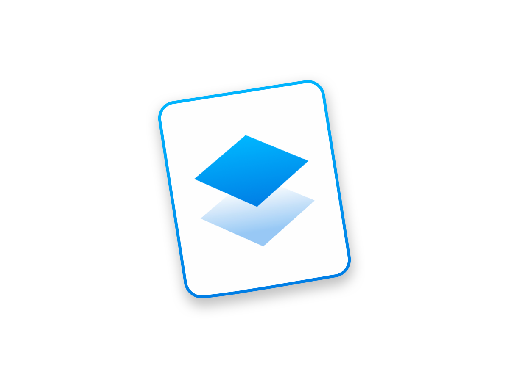
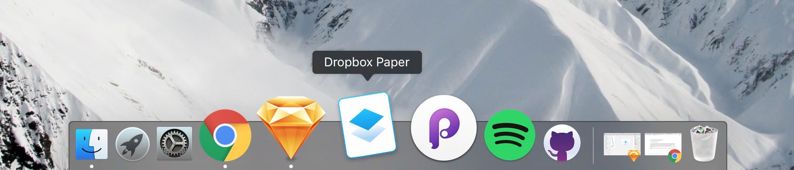

# Dropbox Paper for Mac 
App wrapper around [paper.dropbox.com](https://paper.dropbox.com). Generated with and [nativefier](https://github.com/jiahaog/nativefier).

> ## [Download it here!](https://github.com/LukaMarr/dropbox-paper/raw/master/dropbox-paper-1.0.0.zip) 

  

This is not an official Dropbox product. Paper logo by [Dropbox](https://medium.com/dropbox-design).   
There are two Dropbox Paper unofficial Mac apps.  
- [Dropbox Paper Mac by mituoh](https://github.com/mituoh/Dropbox-Paper-Mac)
- [Paper for Mac by williambout](https://github.com/williambout/paper-for-mac)

So, why I made this? I'm using Paper a lot for writing and Dropbox Paper Mac app by mituoh popped up on Product hunt so I downloaded it, but the icon was made with Dropbox logo and I didn't like that, because there is beautiful original Paper logo out there. Next, I found out that it was made just with this thing called nativefier. I had no idea what it is so I checked it out and it turns out it's a really cool tool where you basically make a native Mac/Windows/Linux app just by entering an url inside a terminal. I installed node.js and nativefier, made new app icon, and voila. 

I'm a design student and I have never used terminal or node.js for anything, so it was a really cool way to figure some things out.